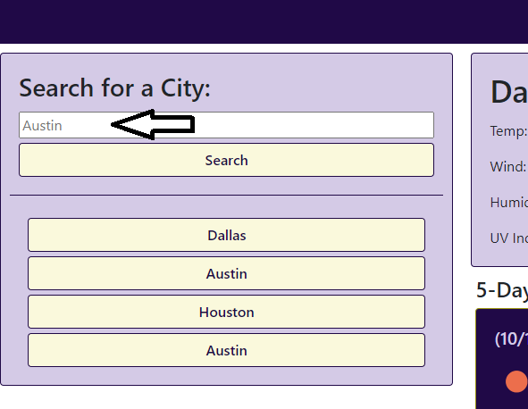
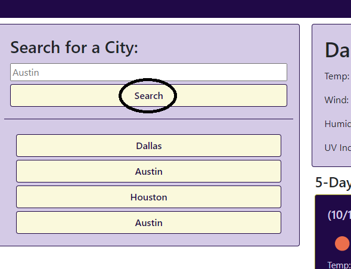
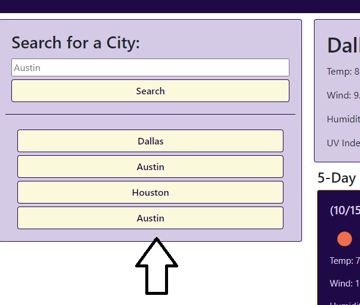

# WeatherDashboard

Weather Dashboard is a web application to show weather conditions for the current day, and five day forcast using a search.

## Table of Contents
- Access
- Usage
- Links
- License

## Access
To access this web application please click the [Deployed Application](https://paw6063.github.io/WeatherDashboard/) link.

## Usage
The site will preload Austin's weather conditions (Default City), but you may choice a different city. Click inside the search bar and enter the city name you would like to see the weather in.

Then click the search button to see the results!

Another option is to use the previously searched cities buttons if you have recently searched any cities...

...this will be empty if you have never use this site before.
After searching the city you will see the current weather conditions along with the predicted weather for the next five days.

## Links
- [GitHub Repository](https://github.com/PAW6063/WeatherDashboard)

- [Deployed Application](https://paw6063.github.io/WeatherDashboard/)

## License
[MIT](https://github.com/PAW6063/WeatherDashboard/blob/main/LICENSE)
